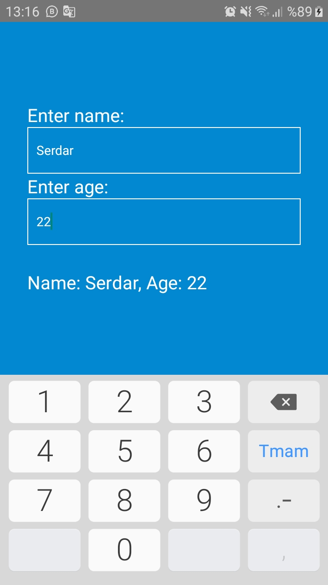

# React-Native : Lessons7_textInput.js 

## Description
- Text Inputs
    - multiline
    - onChangeText
    - placeholder
    - keyboardType

Lessons7_textInput.js: [Klikk på meg](https://github.com/serdardurmus/React-Native-koder/blob/main/learnReactNative/src/Lessons7_textInput.js)

## Happy coding!

## Expected Outcome

