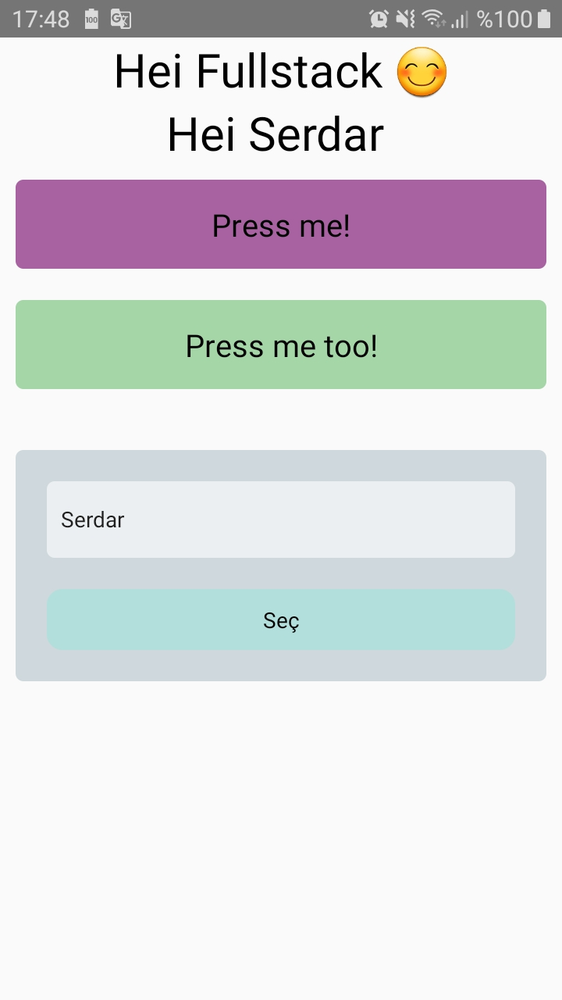
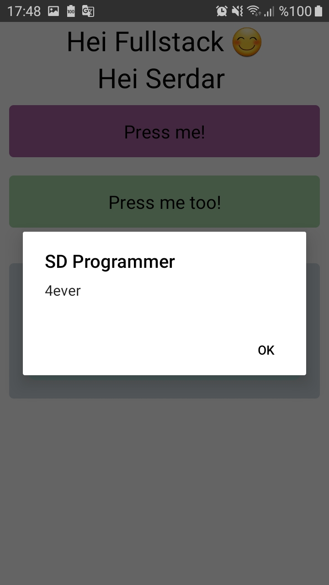

# React-Native : Lessons9_gjenta.js 

## Description
- StyleSheet
- TouchableOpacity
- Alert
- Function

Lessons9_gjenta.js: [Klikk på meg](https://github.com/serdardurmus/React-Native-koder/blob/main/learnReactNative/src/Lessons9_gjenta.js)

## Happy coding!

## Expected Outcome

