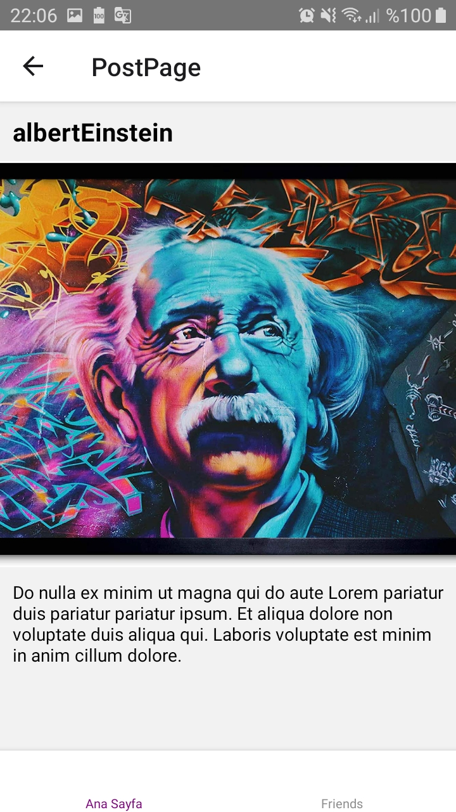

# React-Native : Navigation_sesseon_02.js

## Assignment Statement
- React Navigation
    - install
    - Installing createBottomTabNavigator
    - TouchableWithoutFeedback  <!--  Yanıp sönmeyi engelliyor-->
    - Dimensions

Navigation_sesseon_02.js: [Klikk på meg](https://github.com/serdardurmus/React-Native-koder/blob/main/learnReactNative/src/Navigation_sesseon_02/Router.js)

## Happy coding!

## Expected Outcome

