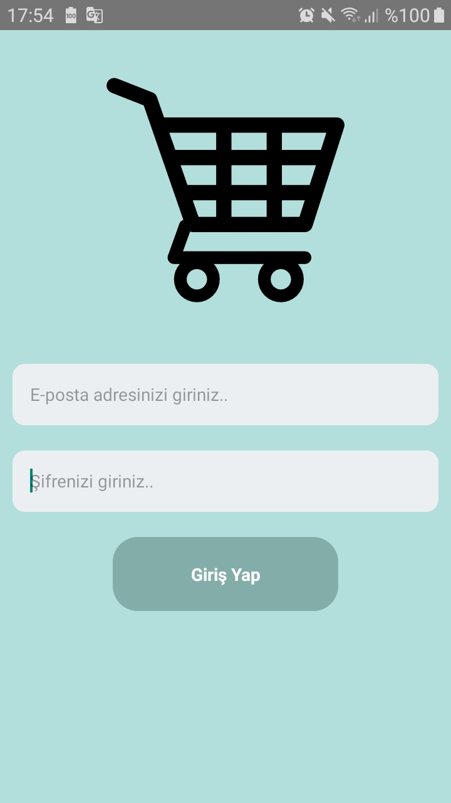

# React-Native : Portfolio_Bulding_1.js

## Assignment Statement
- Portfolio Bulding
    - Button
    - Button onPress
    - Arrow function
    - Dimensions
    - ScrollView
        - bounces (bounces={false} for IOS)
    - KeyboardAvoidingView
        - behavior={Platform.OS = "android" ? null : "padding"}

Portfolio_Bulding_1.js: [Klikk på meg](https://github.com/serdardurmus/React-Native-koder/blob/main/learnReactNative/src/Portfolio_Bulding_1/Login.js)

## Happy coding!

## Expected Outcome

