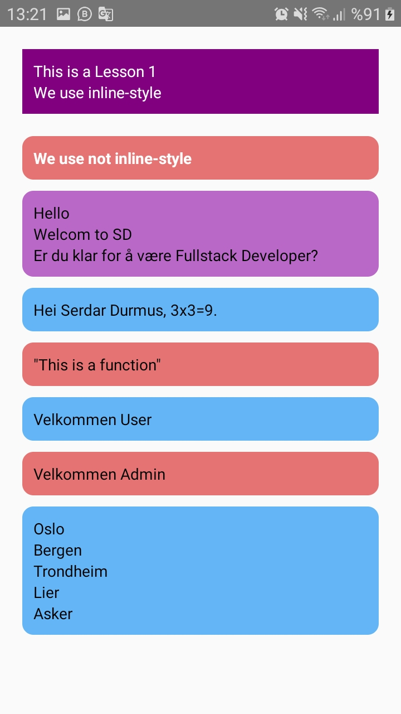

# React-Native : Lessons1.js 

## Description
- Component
- Function
- Variable
- Import / export
- style

Lessons1.js: [Klikk på meg](https://github.com/serdardurmus/React-Native-koder/blob/main/learnReactNative/src/Lessons1.js)

## Happy coding!

## Expected Outcome

