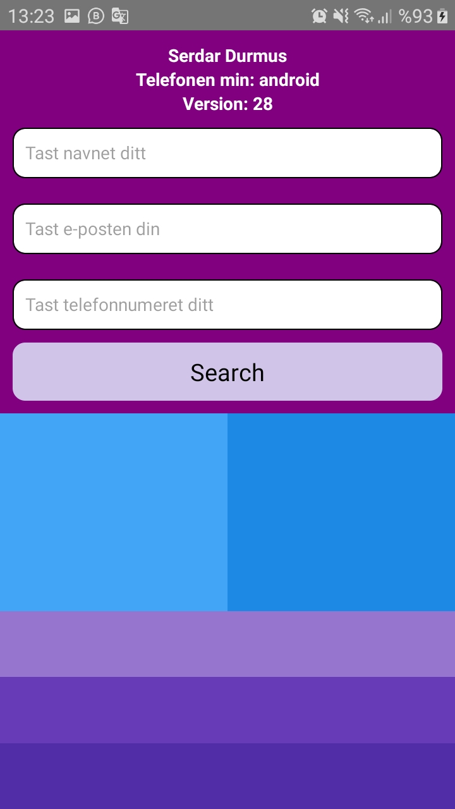

# React-Native : Lessons2.js 

## Description
- Flex
    - justifyContent
    - alignItems
- TextInput
    - placeholder
    - keyboardType
- Platform
    - OS
    - Version
- TouchableOpacity

Lessons2.js: [Klikk på meg](https://github.com/serdardurmus/React-Native-koder/blob/main/learnReactNative/src/Lessons2.js)

## Happy coding!

## Expected Outcome

