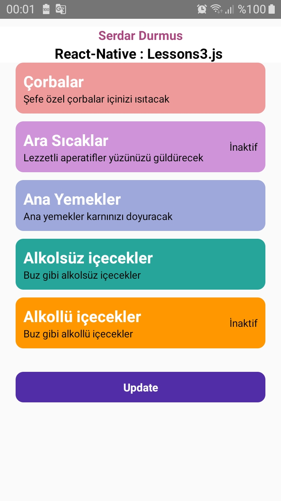

# React-Native : Lessons3.js 

## Description
- Components
- Override
- TouchableOpacity
    - onPress
    - onLongPress
- Array

Lessons3.js: [Klikk på meg](https://github.com/serdardurmus/React-Native-koder/blob/main/learnReactNative/src/Lessons3.js)

## Happy coding!

## Expected Outcome

