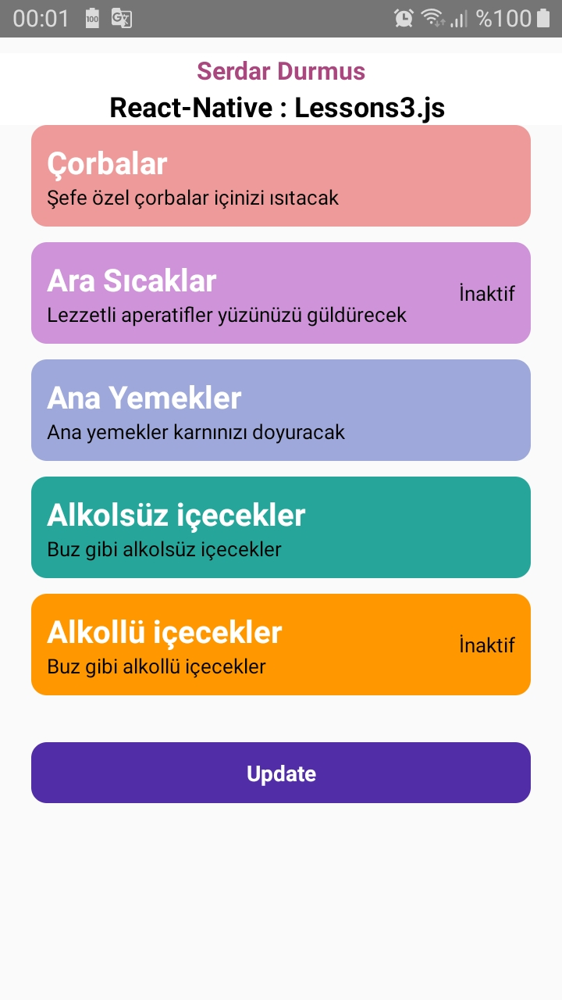

# React-Native : Lessons4.js 

## Description
- Class
- Function
- State !

Lessons4_class.js: [Klikk på meg](https://github.com/serdardurmus/React-Native-koder/blob/main/learnReactNative/src/Lessons4_class.js)

Lessons4_functional.js: [Klikk på meg](https://github.com/serdardurmus/React-Native-koder/blob/main/learnReactNative/src/Lessons4_functional.js)

Lessons4_state.js: [Klikk på meg](https://github.com/serdardurmus/React-Native-koder/blob/main/learnReactNative/src/Lessons4_state.js)

## Happy coding!

## Expected Outcome

