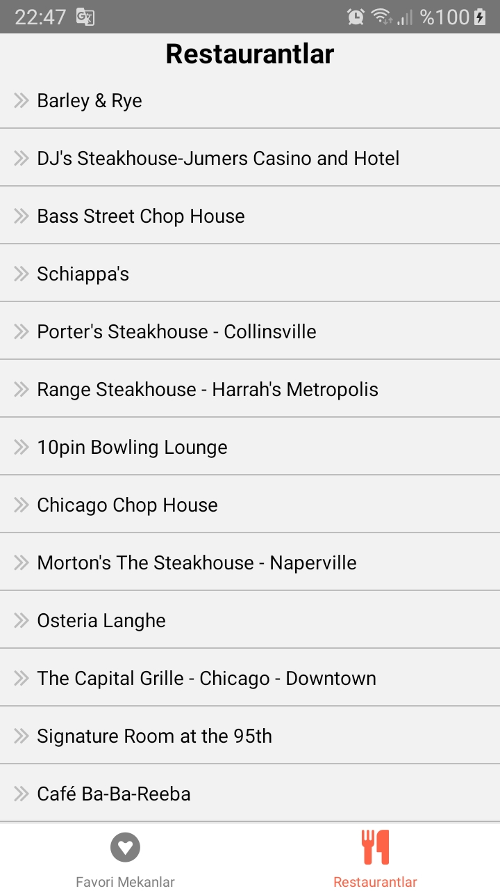

# React-Native : redux_session_2

## Description
- import { NavigationContainer } from '@react-navigation/native';
- import { createBottomTabNavigator } from '@react-navigation/bottom-tabs';
- import Icon from 'react-native-vector-icons/FontAwesome';

- import { createStore } from 'redux';
- import { Provider } from 'react-redux';

redux_session_2: [Klikk på meg](https://github.com/serdardurmus/React-Native-koder/blob/main/learnReactNative/src/redux_session_2/Router.js)

## Happy coding!

## Expected Outcome

